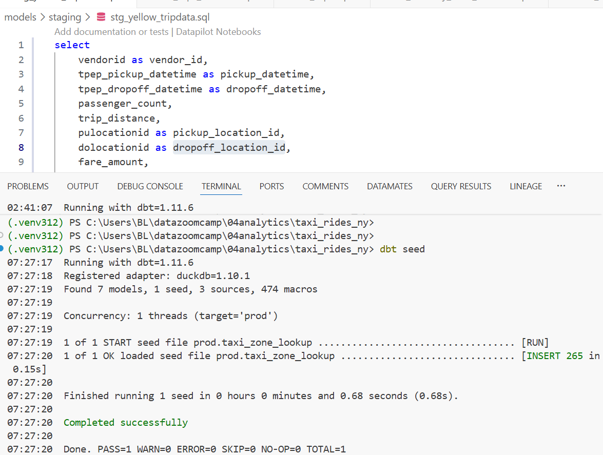
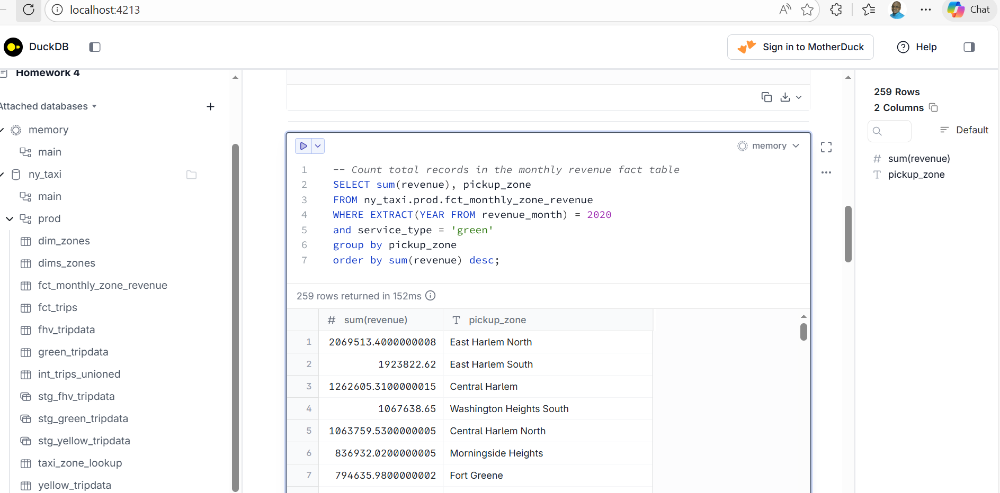
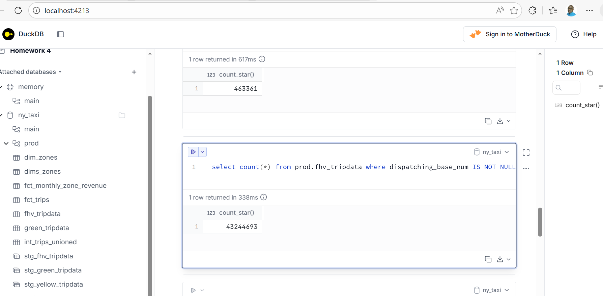
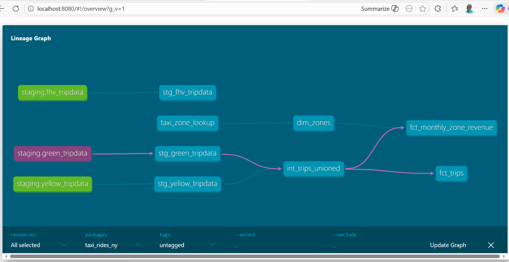
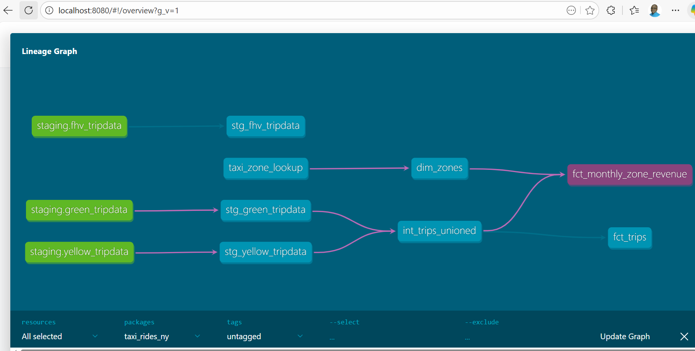
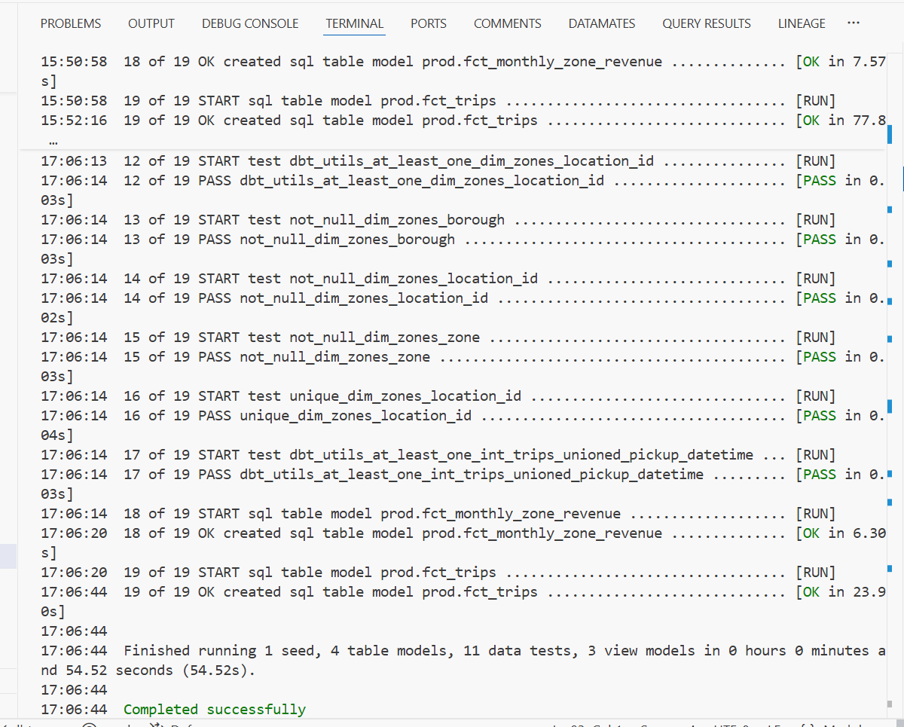

## Analytics Engineering with dbt + DuckDB

### 📌 Project Overview

This project demonstrates a complete **Analytics Engineering workflow** using:

- dbt (data build tool)
- DuckDB
- NYC Taxi dataset
- Dimensional modeling (fact & dimension tables)
- Data lineage visualization

The goal is to transform raw taxi trip data into analytics-ready models using best practices.

---

## Project Architecture

Raw Data → Staging Models → Core Models (Facts & Dimensions) → Analytics Queries

We follow the layered approach:

- **Staging Layer (`stg_`)**
  - Cleans and standardizes raw data
- **Core Layer**
  - `fact_` tables
  - `dim_` tables
- **Analytics Queries**
  - Business questions answered using fact & dimension models

---

## Setup Instructions

### 1. Clone Repository

```bash
git clone https://github.com/biggymuticha/dbt-analytics-engineering.git
cd dbt-analytics-engineering
```

---

### 2. Create Virtual Environment

```bash
python -m venv env
source env/bin/activate   # Mac/Linux
env\Scripts\activate      # Windows
```

---

### 3. Install Dependencies

```bash
pip install dbt-duckdb
pip install duckdb
```

---

### 4. Run dbt Seed (Load Lookup Data)
Download csv with zone lookup data from https://github.com/DataTalksClub/nyc-tlc-data/releases/download/misc/taxi_zone_lookup.csv

Place it in the *seeds/* folder.

Run the following command. 

```bash
dbt seed
```



This loads the **zone lookup file** into DuckDB.


---

### 5. Build All Models

```bash
dbt build
```

This command:
- Runs seeds
- Runs models
- Runs tests

---

## 📂 Data Models

### 🟢 Staging Models

#### `stg_green_tripdata`
- Cleaned Green Taxi trips

#### `stg_fhv_tripdata`
- Cleaned FHV trip data

---

### 🔵 Dimension Tables

#### `dim_zones`
- Taxi zone metadata
- Borough
- Zone name
- Location ID

After changes:

```bash
dbt build --select dim_zones
```


---

### 🔴 Fact Tables

Fact tables contain measurable metrics such as:
- trip distance
- total amount
- fare amount
- passenger count

---

## 🧠 Business Questions & SQL Queries

Below are some of the queries you can run in DuckDB UI.

---

### 1. Zone with Highest Revenue (Green Taxis – 2020)

```sql
SELECT
    z.zone,
    SUM(f.total_amount) AS total_revenue
FROM fact_green_taxi_trips f
JOIN dim_zones z
    ON f.pickup_location_id = z.location_id
WHERE EXTRACT(YEAR FROM f.lpep_pickup_datetime) = 2020
GROUP BY z.zone
ORDER BY total_revenue DESC
LIMIT 1;
```


This query:
- Filters for year 2020
- Aggregates revenue
- Joins zone dimension
- Returns top revenue-generating zone

---

### 2. Count of Records in `stg_fhv_tripdata`
(Filter: dispatching_base_num IS NOT NULL)

```sql
SELECT COUNT(*)
FROM stg_fhv_tripdata
WHERE dispatching_base_num IS NOT NULL;
```



This retrieves all FHV (for-hire vehicles)  trip data from staging table filtering out those with missing dispatching base numbers .

---

## 📊 Understanding the Lineage Graph

Run:

```bash
dbt docs generate
dbt docs serve
```

Open the browser → View Lineage Graph.





### What Lineage Graph Shows:

- How raw sources feed into staging models
- How staging models feed into fact and dimension tables
- Dependency flow between models

Example Flow:

```
source → tax_zone_lookup    →        dim_zones
                                                 ↘
source → stg_green_tripdata → int-trips-unioned → fct-monthly-zone-revenue
                      
                       
```

### Value addition:
The lineage graph is important  in that it
- Shows transformation transparency
- Helps debug downstream issues
- Improves maintainability
- Ensures controlled data dependencies

---

## 📈 dbt Build Output

When running:

```bash
dbt build
```


You should see:
- Models created successfully
- Seeds loaded
- Tests passed
- Execution time summary


---

## 🧪 Testing & Validation

dbt automatically runs tests defined in `schema.yml`:

- Not null tests
- Unique tests
- Referential integrity tests

If tests fail:
- dbt shows failing rows
- Build status indicates failure

---

## 🚀 Key Learnings

- How to structure analytics engineering projects
- How to use staging → marts modeling pattern
- How to use DuckDB as local analytics engine
- How to generate documentation & lineage
- How to answer business questions with fact/dimension modeling

---

## 📌 Technologies Used

- dbt
- DuckDB
- SQL
- Git & GitHub

---


---
### 🤝 Contribution & Feedback

This is a portfolio project showcasing production-ready analytics engineering practices. Feedback welcome!

**Contact:**
- [GitHub](https://github.com/biggymuticha)
- [LinkedIn](https://www.linkedin.com/in/bigboy-m-57211074/)


---

## 📄 License

This project uses NYC TLC Trip Record Data, which is public domain. The code and documentation are available under the MIT License.

**Data Attribution:**
- NYC Taxi & Limousine Commission (TLC)
- [TLC Trip Record Data](https://www.nyc.gov/site/tlc/about/tlc-trip-record-data.page)

---

## 🙏 Acknowledgments

- **DataTalksClub** for the excellent Data Engineering Zoomcamp curriculum. [Link to course](https://github.com/DataTalksClub/data-engineering-zoomcamp/).
- **dbt Labs** for the modern analytics engineering framework
- **DuckDB** for the high-performance embedded database

---

### 📌 Citation

*All technical work, data modeling, and documentation screenshots were produced by the author. This README was structured and refined with the assistance of AI to ensure clarity and professional presentation.*


---
